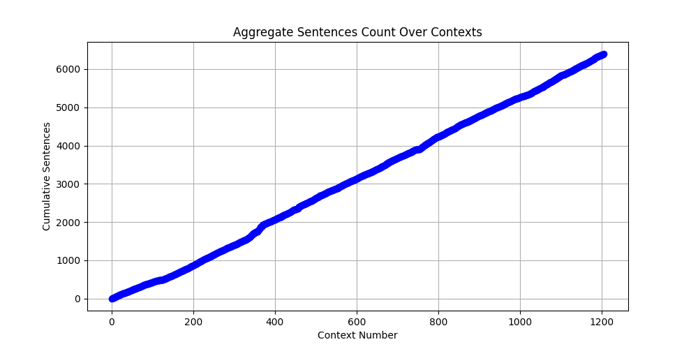
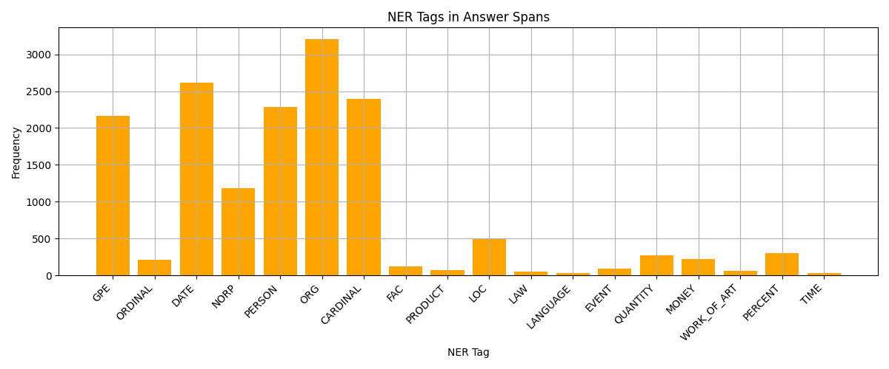
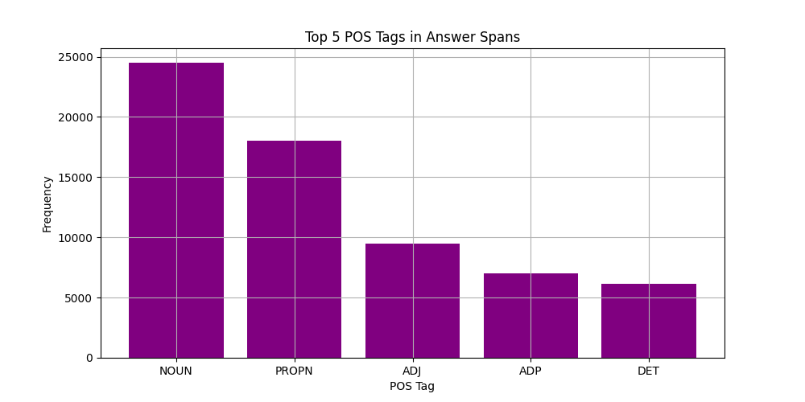
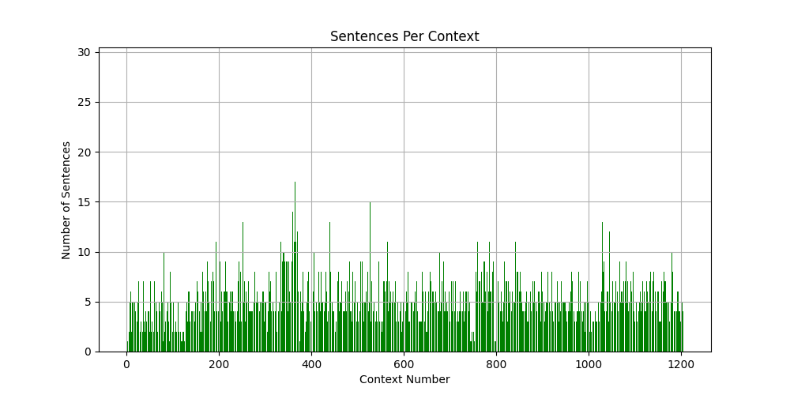
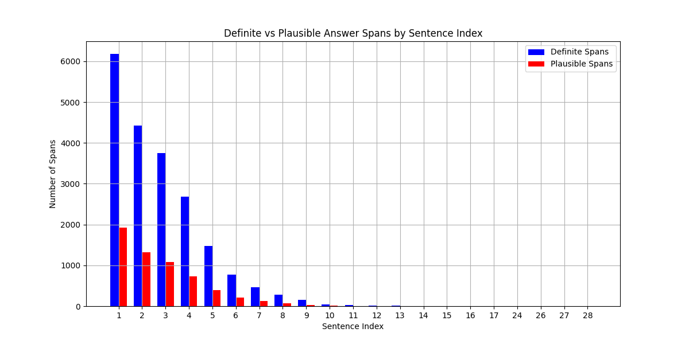

# Plots

Below are the generated plots for the SQuAD Data Analysis project. Each plot is displayed using Markdown image embedding.

## Aggregate Sentences

## NER Distribution

## POS Distribution

## Sentences Per Context

## Span Distribution

